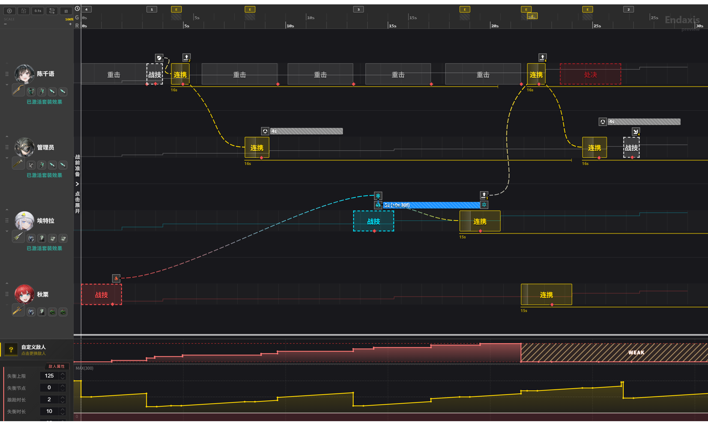

# ZZZ Timeline Editor - 《绝区零》排轴工具

**ZZZaxis** 是一个基于 Web 专为《绝区零》设计的可视化时间轴编辑工具。

> ⚠️ **注意**：本项目基于https://github.com/Lieyuan621/Endaxis修改，去除了战斗模拟部分，只保留可视化时间轴编辑功能。是一个粉丝自制工具，目前处于开发阶段。

## 目前所能实现的效果


尚未完成

## ✨ 核心功能

- **🎯 高精度排轴**：基于 CSS Grid 的时间网格，支持精确到 `1帧` 的动作块拖拽与对齐。
- **🔄 拖放交互**：使用 `Vue.Draggable` 实现流畅的技能拖放体验，支持从技能库拖入轨道及轨道内调整。
- **👥 多角色管理**：支持动态切换轨道代理人或邦布，严格的放置判定逻辑确保操作准确性。
- **🛠️ 内置数据编辑器**：提供可视化的 JSON 数据编辑器，方便维护干员属性与技能数据。

## 🛠️ 技术栈

本项目使用现代前端技术栈构建：

- **框架**: [Vue 3](https://vuejs.org/) (Composition API)
- **构建工具**: [Vite](https://vitejs.dev/)
- **状态管理**: [Pinia](https://pinia.vuejs.org/)
- **UI 组件库**: [Element Plus](https://element-plus.org/)
- **国际化**: [vue-i18n](https://vue-i18n.intlify.dev/)
- **拖拽库**: [Vue.Draggable](https://github.com/SortableJS/vue.draggable.next)
- **样式**: CSS Grid + CSS Variables

## 🌍 i18n（基础配置）

目前项目已完成 vue-i18n + Element Plus 语言包的基础接入（见 `src/i18n/index.js`）。

- 默认语言：`zh-CN`
- 语言持久化：`localStorage` key 为 `endaxis_locale`
- 翻译文件：`src/i18n/locales/zh-CN.json`

## 🔧 开发者工具

项目内置了一个隐藏的数据编辑器，用于生成 `gamedata.json` 文件。

**访问地址：**

- **本地开发**：`http://localhost:5173/editor`

**使用说明：**

1. 访问上述页面。
2. 在此页面可以添加新干员、修改技能属性（持续时间、伤害帧、取消窗口等）。
3. 点击“生成并下载”按钮，将下载的文件覆盖项目中的 `public/gamedata.json` 即可更新数据。

## 🚀 本地开发

如果你想在本地运行或参与开发：

### 环境要求

- Node.js (`^20.19.0 || >=22.12.0`)
- npm 或 yarn

### 安装依赖

```bash
npm install
```

### 启动开发服务器

```bash
npm run dev
```

启动后访问 `http://localhost:5173` 即可看到排轴器界面。
